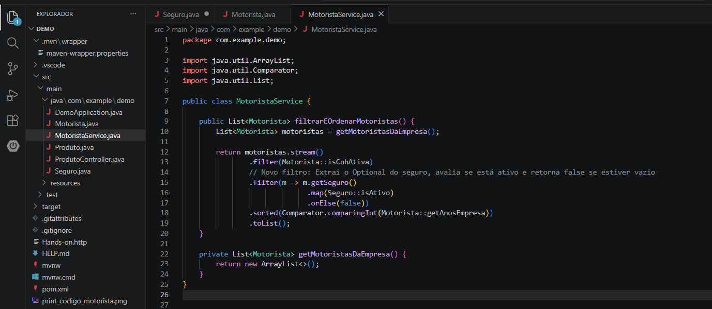

# Atividade: Produtividade com IA

## 🚀 Código Modernizado
```java
package com.example.demo;

import java.util.ArrayList;
import java.util.Comparator;
import java.util.List;

public class MotoristaService {

    public List<Motorista> filtrarEOrdenarMotoristas() {
        List<Motorista> motoristas = getMotoristasDaEmpresa();

        return motoristas.stream()
                .filter(Motorista::isCnhAtiva)
                .filter(m -> m.getSeguro()
                              .map(Seguro::isAtivo)
                              .orElse(false))
                .sorted(Comparator.comparingInt(Motorista::getAnosEmpresa))
                .toList();
    }

    private List<Motorista> getMotoristasDaEmpresa() {
        return new ArrayList<>();
    }
}
```

## 🧠 Relato do Aprendizado
O insight mais importante fornecido pela IA foi compreender como o método `.toList()` do Java 16+ traz segurança através da imutabilidade por padrão. Além disso, o desafio de integrar o `Optional` no pipeline da Stream mostrou como tratar possíveis valores nulos de forma puramente declarativa com `.map()` e `.orElse(false)`, eliminando checagens manuais ruidosas e blindando o código contra o erro de NullPointerException.

## 💬 Prompt de Desafio
"Agora, explique-me: se eu quisesse que esse filtro também removesse motoristas que não possuem um Optional de seguro ativo, como eu alteraria essa Stream? Não me dê o código, explique-me a lógica."


## 🖼️ Captura de Tela

